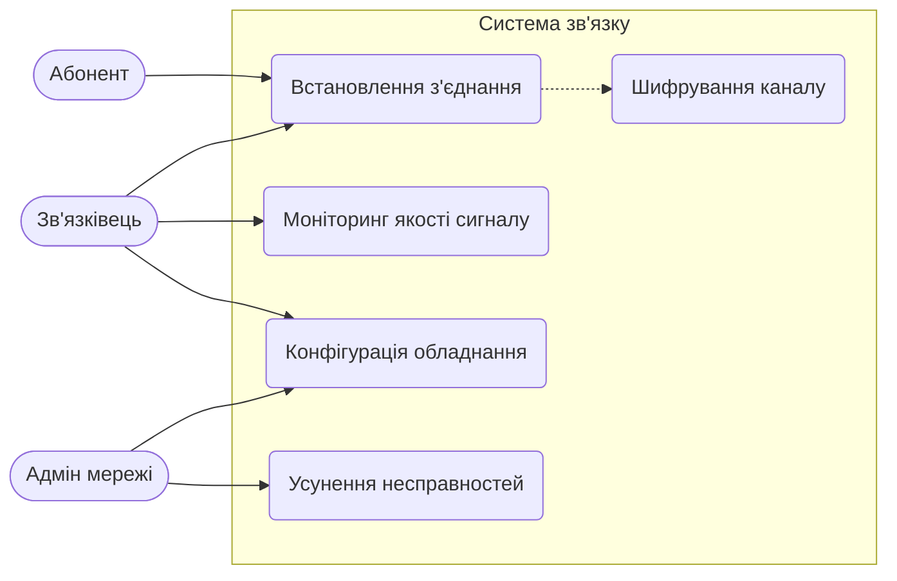
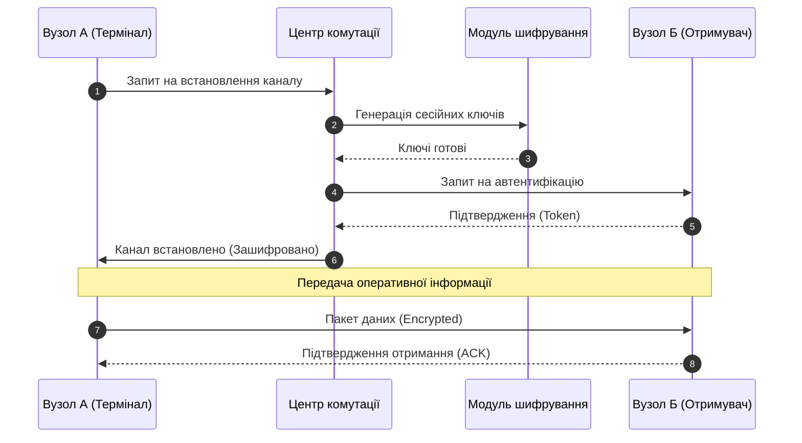
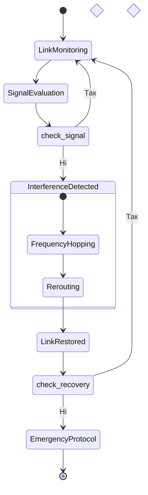

# Практична робота: Побудова поведінкових UML-діаграм
**Тема:** Проєктування системи забезпечення захищеного зв'язку (Secure Communication System)

## Опис проєкту
Система призначена для автоматизації процесів встановлення, моніторингу та відновлення каналів зв'язку. Вона забезпечує стабільне з'єднання між віддаленими абонентами через різні типи каналів із використанням шифрування.

---

## 1. Діаграма варіантів використання (Use Case Diagram)

---

## 2. Діаграма послідовності (Sequence Diagram)

---

## 3. Діаграма діяльності (Activity Diagram)

---
**Виконав:** [Ваше Ім'я]
